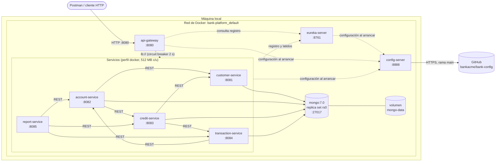
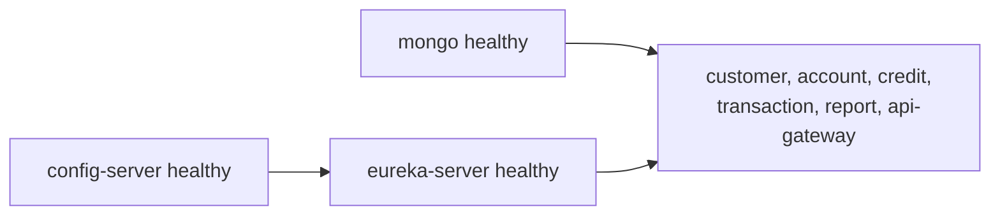

# Diagrama de despliegue — P2 (`docker-compose`)

Lo que levanta `docker compose up -d` en `bank-platform`, con las imágenes `hbcordova10/bank-*:latest` de Docker Hub. Todo corre en una red de Docker
(`bank-platform_default`); desde la máquina se entra por el Gateway (8080). Los puertos de los
servicios también se publican, solo para pruebas directas y para el panel de Eureka.

## Arranque

## Notas

- **Una imagen por servicio**, publicada en Docker Hub por el pipeline de GitHub Actions al hacer merge a `main` (amd64 y arm64). El `Dockerfile` tiene dos etapas (Maven → JRE 17) y
  separa las capas de Spring Boot: cambiar el código no vuelve a copiar las dependencias.
- **Sin estado en los contenedores** salvo Mongo: los datos viven en el volumen `mongo-data`, que
  sobrevive a `docker compose down` (se borra con `down -v`).
- **Una base por servicio** en el mismo Mongo; `report-service` no tiene base en P2.
- **Qué cambia en P3:** se suman Kafka (KRaft) y Redis a esta red, y `auth-service`,
  `debit-service` y `yanki-service`.
